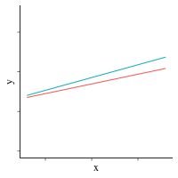

<br>
<center><span style="color:#3875d8;font-size:1.5em">*Template 6:*</span>



<span style="color:#3875d8;font-size:2em">**Interaction of one continuous & one categorical independent variable (line graph)**</span></center>


##Introduction
Welcome! This template will guide you through a Bayesian analysis in R, even if you have never done Bayesian analysis before. There are a set of templates, each for a different type of analysis. This template is for data with **one continuous and one categorical independent variable** and will produce a **line chart**. If your analysis includes a **linear regression**, this might be the right template for you.

This template assumes you have basic familiarity with R. Once complete, this template will produce a summary of the analysis, complete with parameter estimates and credible intervals, and two animated HOPs (see Hullman, Resnick, Adar 2015 DOI: 10.1371/journal.pone.0142444 and Kale, Nguyen, Kay, and Hullman VIS 2018 for more information) for both your prior and posterior estimates.

This Bayesian analysis focuses on producing results in a form that are easily interpretable, even to nonexperts. The credible intervals produced by Bayesian analysis are the analogue of confidence intervals in traditional null hypothesis significance testing (NHST). A weakness of NHST confidence intervals is that they are easily misinterpreted. Many people naturally interpret an NHST 95% confidence interval to mean that there is a 95% chance that the true parameter value lies somewhere in that interval; in fact, it means that if the experiment were repeated 100 times, 95 of the resulting confidence intervals would include the true parameter value. The Bayesian credible interval sidesteps this complication by providing the intuitive meaning: a 95% chance that the true parameter value lies somewhere in that interval. To further support intuitive interpretations of your results, this template also produces animated HOPs, a type of plot that is more effective than visualizations such as error bars in helping people make accurate judgments about probability distributions.

This set of templates supports a few types of statistical analysis. (In future work, this list of supported statistical analyses will be expanded.) For clarity, each type has been broken out into a separate template, so be sure to select the right template before you start! A productive way to choose which template to use is to think about what type of chart you would like to produce to summarize your data. Currently, the templates support the following:

*One independent variable:*

1. Categorical; bar graph (e.g. t-tests, one-way ANOVA)

2. Ordinal; line graph (e.g. t-tests, one-way ANOVA)

3. Continuous; line graph (e.g. linear regression)

*Two interacting independent variables:*

4. Two categorical; bar graph (e.g. two-way ANOVA)

5. One categorical, one ordinal; line graph (e.g. two-way ANOVA)

6. **One categorical, one continuous; line graph (e.g. linear regression with multiple lines)**

Note that this template fits your data to a model that assumes normally distributed error terms. (This is the same assumption underlying t-tests, ANOVA, etc.) This template requires you to have already run diagnostics to determine that your data is consistent with this assumption; if you have not, the results may not be valid. 

Once you have selected your template, to complete the analysis, please follow along this template. For each code chunk, you may need to make changes to customize the code for your own analysis. In those places, the code chunk will be preceded by a list of things you need to change (with the heading <span style="color:red">"What to change"</span>), and each line that needs to be customized will also include the comment `#CHANGE ME` within the code chunk itself. You can run each code chunk independently during debugging; when you're finished, you can knit the document to produce the complete document.

Good luck!


###Sample dataset
This template comes prefilled with an example dataset from Moser et al. (DOI: 10.1145/3025453.3025778), which examines choice overload in the context of e-commerce. The study examined the relationship between choice satisfaction (measured at a 7-point Likert scale), the number of product choices presented on a webpage, and whether the participant is a decision "maximizer" (a person who examines all options and tries to choose the best) or a "satisficer" (a person who selects the first option that is satisfactory). In this template, we analyze the relationship between choice set size, which we treat as a continuous variable in this template with values that can fall in the range [12,72]; type of decision-making (maximizer or satisficer), a two-level categorical variable; and choice satisfaction, which we treat as a continuous variable with values that can fall in the range [1,7].


##Set up
###Requirements
To run this template, we assume that you are using RStudio, and you have the most recent version of R installed. (This template was built with R version 3.5.1.) 

This template works best if you first open the file `bayesian-template.Rproj` from the code repository as a project in RStudio to get started, and then open the individual `.Rmd` template files after this.

###Libraries
<span style="color:red">**Installation:**</span> 
If this is your first time using the template, you may need to install libraries. 

1.  **If you are using Windows,** first you will need to manually install RStan and Rtools. Follow the instructions [here](https://github.com/stan-dev/rstan/wiki/Installing-RStan-on-Windows) to install both. 

2.  On both Mac and Windows, uncomment the lines below - `install.packages()` and `devtools::install_github()` - to install the required packages. This only needs to be done once. 

<span style="color:red">**Troubleshooting:**</span> 
You may have some trouble installing the packages, especially if you are on Windows. Regardless of OS, if you have any issues installing these packages, try one or more of the following troubleshooting options:

1. Restart R. This is especially important after you install `devtools`, which requires a restart to work properly.

2. Make sure you are running the most recent version of R (3.5.1, as of the writing of this template).

3. Manually install RStan and Rtools, following the instructions [here](https://github.com/stan-dev/rstan/wiki/RStan-Getting-Started).

4. If you have tried the above and you are still getting error messages like `there is no package called [X]`, try installing the missing package(s) manually using the RStudio interface under Tools > Install Packages...

```{r libraries, message=FALSE, warning=FALSE}

knitr::opts_chunk$set(fig.align="center") 

# install.packages(c("ggplot2", "rstanarm", "tidyverse", "tidybayes", "modelr", "gganimate"))

library(rstanarm) #bayesian analysis package
library(tidyverse) #tidy datascience commands
library(tidybayes) #tidy data + ggplot workflow
library(modelr) #tidy pipelines for modeling
library(ggplot2) #plotting package
library(gganimate) #animate ggplots

theme_set(theme_light()) # set the ggplot theme for all plots 

```

###Read in data
<span style="color:red">**What to change**</span>

1. mydata: Read in your data. 

```{r data_prep}

mydata = read.csv('datasets/choc_cleaned_data.csv') #CHANGE ME 1

```


## Specify model
We'll fit the following model: `stan_glm(y ~ x1 * x2)`, where $x_1$ is a continuous variable and $x_2$ is a categorical variable. This specifies a linear regression with a parameter for $x_1$ and dummy variables for each level in $x_2$, plus interaction terms for each combination of $x_1$ and $x_2$. So for example, for a regression where $x_2$ has two levels, each $y_i$ is drawn from a normal distribution with mean equal to the value of the specified regression equation and standard deviation equal to `sigma` ($\sigma$): 

$$
y_i \sim Normal(a + b_{x1}x_i + b_{x2}dummy_{x2} +  b_{x1}x_i * b_{x2}dummy_{x2}, \sigma)
$$

Choose your independent and dependent variables. These are the variables that will correspond to the x and y axis on the final plots. 

<span style="color:red">**What to change**</span>

2. mydata\$x1: Select which variables will appear on the x-axis of your plots. This is your continuous variable. 

3. mydata\$x2: Select the second independent variable, the categorical variable. You will have one line in the output graph for each level of this variable.

4. mydata\$y: Select which variables will appear on the y-axis of your plots. 

5. x_lab: Label your plots' x-axes.

6. y_lab: Label your plots' y-axes.

```{r specify_model}

#select your independent and dependent variables
mydata$x1 = mydata$num_products_displayed #CHANGE ME 2
mydata$x2 = mydata$sat_max #CHANGE ME 3
mydata$y = mydata$satis_Q1 #CHANGE ME 4

# label the axes on the plots
x_lab = "Choices" #CHANGE ME 5
y_lab = "Satisfaction" #CHANGE ME 6

```


###Set  priors
In this section, you will set priors for your model. Setting priors thoughtfully is important to any Bayesian analysis, especially if you have a small sample of data that you will use for fitting for your model. The priors express your best prior belief, *before seeing any data*, of reasonable values for the model parameters. 

Ideally, you will have previous literature from which to draw these prior beliefs. If no previous studies exist, you can instead assign "weakly informative priors" that only minimally restrict the model, excluding only values that are implausible or impossible. We have provided examples of how to set both weak and strong priors below.

To check the plausibility of your priors, use the code section after this one to generate a graph of five sample draws from your priors to check if the values generated are reasonable.

Our model has the following parameters:

a. the overall mean y-value across all levels of categorical variable x

b. the mean y-value for each of the individual levels

c. the standard deviation of the normally distributed error term

To simplify things, we limit the number of different prior beliefs you can have. Think of the first level of the categorical variable as specifying the control condition of an experiment, and all of the other levels being treatment conditions in the experiment. We let you specify a prior belief about the plausible values of mean in the control condition (a), and then we let you set a prior belief about the plausible effect size (b). You have to specify the same plausible effect sizes for all conditions, unless you dig deeper into our code.

To simplify things further, we only let you specify beliefs about these parameters in the form of a normal distribution. Thus, you will specify what you think is the most likely value for the parameter (the mean), and a standard deviation. You will be expressing a belief that you were 95% certain (before looking at any data) that the true value of the parameter is within two standard deviations of the mean.

Finally, our modeling system, `stan_glm()`, will automatically set priors for the last parameter, the standard deviation of the normally distributed error term for the model overall (c).

Want more examples? Check your understanding of how to set priors in this [quizlet](https://cdphelan.shinyapps.io/check_understanding_priors/), which includes several more examples of how to set both strong and weak priors.

<span style="color:red">**What to change**</span>

**If you are using weakly informative priors (i.e. priors not informed by previous literature):**

*Remember: **do not** use any of your data from the current study to inform prior values.*

7. a_prior: Select the control condition mean. 

8. a_prior_max: Select the maximum plausible value of the control condition data. (We will use this to calculate the sd of `a`.)

9. b1_prior: Select the effect size mean. 

10. b1_sd: Select the effect size standard deviation. 

11. You should also change the comments in the code below to explain your choice of priors.

**If you are using strong priors (i.e. priors from previous literature):**

Skip this code chunk and set your priors in the next code chunk. For clarity, comment out everything in this code chunk.

```{r}

# CHANGE THIS COMMENT EXPLAINING YOUR CHOICE OF PRIORS (11)
# In our example dataset, y-axis scores can be in the range [1, 7].
# In the absence of other information, we set the parameter mean as 4 
# (the mean of the range [1,7]) and the maximum possible value as 7.
# From exploratory analysis, we know the mean score and sd for y in our 
# dataset but we *DO NOT* use this information because priors *CANNOT* 
# include any information from the current study. 

a_prior = 4 # CHANGE ME 7  
a_prior_max = 7 # CHANGE ME 8

# With a normal distribution, we can't completely rule out
# impossible values, but we choose an sd that assigns less than
# 5% probability to those impossible values. Remember that in a normal
# distribution, 95% of the data lies within 2 sds of the mean. Therefore,
# we calculate the value of 1 sd by finding the maximum amount our data
# can vary from the mean (a_prior_max - a_prior) and divide that in half.

a_sd = (a_prior_max - a_prior) / 2  # do not change

# CHANGE THIS COMMENT EXPLAINING YOUR CHOICE OF PRIORS (11)
# In our example dataset, we do not have a strong hypothesis that the treatment 
# conditions will be higher or lower than the control, so we set the mean of
# the effect size parameter to be 0. In the absence of other information, we
# set the sd so that a change from the minimum choice set size (12) 
# to the maximum choice set size (72) could plausibly result in a 
# +6/-6 change in satisfaction, the maximum possible change.

b1_prior = 0  # CHANGE ME 9
b1_sd = (6/(72-12))/2   # CHANGE ME 10

```


<span style="color:red">**What to change**</span>

**If you are using weakly informative priors:**

Do not use this code chunk; use the code chunk above to set your priors instead. Make sure everything in this code chunk is commented out so that your priors are not overwritten.

**If you are using strong priors (i.e. priors from previous literature):**

*Remember: **do not** use any of your data from the current study to set prior values.*

First, make sure to uncomment all four variables set in this code chunk.

7. a_prior: Select the control condition mean.

8. a_sd: Select the control condition standard deviation.

9. b1_prior: Select the effect size mean. 

10. b1_sd: Select the effect size standard deviation.

11. You should also change the comments in the code below to explain your choice of priors.

```{r}

# CHANGE THIS COMMENT EXPLAINING YOUR CHOICE OF PRIORS (11)
# In our example dataset, y-axis scores can be in the range [1, 7].
# To choose our priors, we use the results from a previous study 
# where participants completed an identical task (choosing between 
# different chocolate bars). For our overall prior mean, we pool the mean
# satisfaction scores from all conditions in the previous study to get 
# an overall mean of 5.86. We set a_sd so that 5.86 +/- 2 sds encompasses
# the 95% confidence intervals from the previous study results.

# a_prior = 5.86  # CHANGE ME 7
# a_sd = 0.6     # CHANGE ME 8

# CHANGE THIS COMMENT EXPLAINING YOUR CHOICE OF PRIORS (11)
# In this example, we do not have guidance from previous literature
# to set an effect size on satisfaction with an interaction term between
# choice size and maximizer score, so we set the mean effect size
# at 0. To reflect the uncertainty in this effect size, we set the sd 
# so that a change from the minimum choice set size (12) to the maximum
# choice set size (72) could plausibly result in a +6/-6 change
# in satisfaction, the maximum possible change.

# b1_prior = 0 # CHANGE ME 9
# b1_sd = (6/(72-12))/2   # CHANGE ME 10

```


### Check priors
Next, you'll want to check your priors by running this code chunk. It will produce a set of 100 sample draws drawn from the priors you set in the previous section, so you can check to see if the values generated are reasonable. (We'll go into the details of this code later.) 

<span style="color:red">**What to change**</span>

Nothing! Just run this code to check your priors, adjusting prior values above as needed until you find reasonable prior values. Note that you may get a couple of very implausible or even impossible values because our assumption of normally distributed priors assigns a small probability to even very extreme values. If you are concerned by the outcome, you can try rerunning it a few more times to make sure that any implausible values you see don't come up very often.

<span style="color:red">**Troubleshooting**</span>

* In rare cases, you may get a warning that the Markov chains have failed to converge. Chains that fail to converge are a sign that your model is not a good fit to the data. If you get this warning, you should adjust your priors. Your prior distribution may be too narrow, and/or your prior mean is very far from the data.

* If you get any other errors, first double-check the values you have changed in the code chunks above (i.e. `mydata`, `mydata$x1`, `mydata$x2`, `mydata$y`, and prior values). Problems with these values can cause confusing errors downstream. 

```{r check_priors, results="hide"}

#generate sample draws from the priors
m_prior = stan_glm(y ~ x1*x2, data = mydata,
  prior_intercept = normal(a_prior, a_sd, autoscale = FALSE),
  prior = normal(b1_prior, b1_sd, autoscale = FALSE),
  prior_PD = TRUE
)

#create the dataframe for fitted draws & create the plot
mydata %>% 
  data_grid(x1, x2) %>%
  add_fitted_draws(m_prior, n = 100, seed = 12345) %>%
  ggplot(aes(x = x1, y = .value, col = x2, group = x2)) +
    geom_line(aes(group = .draw), alpha = .2) +
    facet_grid(cols = vars(x2)) +
  # coord_cartesian(ylim = c(min(mydata$y, na.rm=T), max(mydata$y, na.rm=T))) + # sets axis limits - CHANGE ME (optional)
    theme(plot.title = element_text(hjust = 0.5),
        legend.position="none") +
    labs(x=x_lab, y=y_lab) + # axes labels 
    ggtitle("100 sample draws from the priors") 


```

### Run the model
There's nothing you have to change here. Just run the model.

<span style="color:red">**Troubleshooting:**</span> If this code produces errors, check the troubleshooting section under the "Check priors" heading above for a few troubleshooting options. 

```{r results = "hide", message = FALSE, warning = FALSE}
m = stan_glm(y ~ x1*x2, data = mydata,
  prior_intercept = normal(a_prior, a_sd, autoscale = FALSE),
  prior = normal(b1_prior, b1_sd, autoscale = FALSE)
)
```


## Model summary
Here is a summary of the model fit.

The summary reports diagnostic values that can help you evaluate whether your model is a good fit for the data. For this template, we can keep diagnostics simple: check that your `Rhat` values are very close to 1.0. Larger values mean that your model is not a good fit for the data. This is usually only a problem if the `Rhat` values are greater than 1.1, which is a warning sign that the Markov chains have failed to converge. In this happens, Stan will warn you about the failure, and you should adjust your priors.

```{r}
summary(m, digits=3)
```


## Visualizing results
Given this model, we might want to plot the fit line with credible bands around it. To do that, we will first construct a *fit grid*: a data frame of points at which we want to calculate the value of the fit line from the model. The `data_grid` function allows us to do this easily, e.g. by asking for 20 equally spaced points along the value of the `x` variable in our original data:

```{r}
mydata %>% 
  data_grid(x1 = seq_range(x1, n = 20), x2)
```

Given this grid, we can then draw samples from the posterior mean evaluated at each x position in the grid using the `add_fitted_draws` function, and then summarize these samples in ggplot using a `stat_lineribbon`. For readability, we'll separate the $x2$ levels into facets:

```{r}
mydata %>% 
  data_grid(x1 = seq_range(x1, n = 20), x2) %>%
  add_fitted_draws(m) %>%
  ggplot(aes(x = x1, y = .value, group = x2)) +
  stat_lineribbon() +
  coord_cartesian(ylim = c(min(mydata$y, na.rm=T), max(mydata$y, na.rm=T))) + # sets axis limits - CHANGE ME (optional)
  scale_fill_brewer() + 
  facet_grid(cols = vars(x2))

```

But what we really want is to display a selection of plausible fit lines, say 100 of them. To do that, we instead ask `add_fitted_draws` for only 100 draws, which we plot separately as lines:

```{r}
mydata %>% 
  data_grid(x1 = seq_range(x1, n = 101), x2) %>%
  # the seed argument is for reproducibility: it ensures the pseudo-random
  # number generator used to pick draws has the same seed on every run,
  # so that someone else can re-run this code and verify their output matches
  add_fitted_draws(m, n = 100, seed = 12345) %>%
  ggplot(aes(x = x1, y = .value, col=x2, group=x2)) +
    coord_cartesian(ylim = c(min(mydata$y, na.rm=T), max(mydata$y, na.rm=T))) + # sets axis limits - CHANGE ME (optional)
    geom_line(aes(group = .draw), alpha = .2) +
    facet_grid(cols = vars(x2)) +
    theme(plot.title = element_text(hjust = 0.5),
        legend.position="none") +
    labs(x=x_lab, y=y_lab) # axes labels 

```

Even better would be to animate this graph using HOPs (Hypothetical Outcomes Plot), a type of plot that visualizes uncertainty as sets of draws from a distribution, which has been demonstrated to improve multivariate probability estimates (Hullman et al. 2015) and increase sensitivity to the underlying trend in data (Kale et al. 2018) over static representations of uncertainty like error bars. 

To set up the HOPs, we will first set the aesthetics for the ggplot that we will use. 

### Plot aesthetics
You can set the aesthetics of your HOPs here.

<span style="color:red">**What to change**</span>

In most cases, the default values here should be just fine. If you want to adjust the aesthetics of the animated plots later, you can do so here using the ggplot2 package; just be sure to keep the lines that are commented with "do not change." Below are two optional code customizations that we think may be particularly useful for some datasets.

11. [Optional] coord_cartesian(ylim = ...): You may want to manually set the y-axis limits. If so, uncomment this line in the code below and set your preferred limits accordingly. 

12. [Optional] scale_x_discrete(limits = ...): You may want to manually set the order of the x-axis levels; for example, if you have levels "before" and "after," ggplot defaults often plot "after" on the left and "before" on the right. If so, uncomment this line in the code below and set your preferred level order. The names of the levels must match what is in your dataset. 

```{r graph_aesthetics}

# the default code for the plots - if needed, the animated plot aesthetics can be customized here
graph_plot = function(data) {
  ggplot(data, aes(x = x1, y = .value, col=x2, group=x2)) + #do not change
    geom_line() + #do not change
    transition_states(.draw, transition_length = 1, state_length = 1) + # gganimate code to animate the plots. Do not change
    coord_cartesian(ylim = c(min(mydata$y, na.rm=T), max(mydata$y, na.rm=T))) + # sets axis limits - CHANGE ME 11 (optional)
    labs(x=x_lab, y=y_lab) # axes labels
}

# Animation parameters
n_draws = 100 # the number of draws to visualize in the HOPs
frames_per_second = 2.5 # the speed of the HOPs
# 2.5 frames per second (400ms) is the recommended speed for the HOPs visualization.
# Faster speeds (100ms) have been demonstrated to not work as well.
# See Kale et al. VIS 2018 for more info.

```

Now that the plot aesthetics are set, we can return to our fit grid and repeatedly draw samples from the posterior mean evaluated at each x position in the grid using the `add_fitted_draws` function. Each frame of the animation shows a different draw from the posterior: 

```{r}

p = mydata %>% 
  data_grid(x1 = seq_range(x1, n = 101), x2) %>%
  add_fitted_draws(m, n = n_draws, seed = 12345) 
  # the seed argument is for reproducibility: it ensures the pseudo-random
  # number generator used to pick draws has the same seed on every run,
  # so that someone else can re-run this code and verify their output matches

animate(graph_plot(p), nframes = n_draws * 2, fps = frames_per_second)

```

For more context, we could also show the fit lines with the data:

```{r}
animate(graph_plot(p) + 
          geom_count(aes(y = y), data = mydata, 
                     position=position_dodge(5)), 
        nframes = n_draws * 2, fps = frames_per_second)
```

## Sampling from the prior

We already looked at some sample plots of the priors when we were setting priors; now we want to look at these priors again, but in a HOPs format so we can compare to the posterior plots. To get the prior plots, we can simply ask `stan_glm` to sample from the prior. 

<span style="color:red">**What to change**</span>

If you are knitting this document, or if you already ran the code in the "Check priors" section that calculates m_prior, you can comment out this line:

```{r, results = "hide", message = FALSE, warning = FALSE}
#m_prior = update(m, prior_PD = TRUE)
```

Then our code to generate plots is identical, except we replace `m` with `m_prior`:

```{r}

p_prior = mydata %>% 
  data_grid(x1 = seq_range(x1, n = 101), x2) %>%
  add_fitted_draws(m_prior, n = n_draws, seed = 12345)

animate(graph_plot(p_prior), nframes = n_draws * 2, fps = frames_per_second) 

```


Again, with context:

```{r}
animate(graph_plot(p_prior) + 
          geom_count(aes(y = y), data = mydata, 
                     position=position_dodge(5)), 
        nframes = n_draws * 2, fps = frames_per_second)
```
