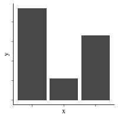
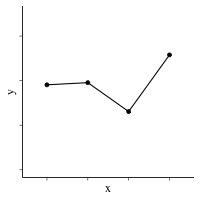
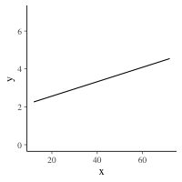
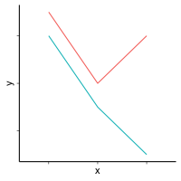

# bayesian-template

This repo is a set of templates that will guide you through a Bayesian analysis in R, even if you have never done Bayesian analysis before. There are a set of templates, each for a different type of analysis. Over time, we will be adding to this list of templates.

A productive way to choose which template to use is to think about what your independent variables are and what type of chart you would like to produce to summarize your data. Currently, the templates support the following:

## One independent variable

**1) Categorical**: 
 

Creates a bar chart; compatible with tests such as t-tests, one-way ANOVA

Use this template file:
    
    1var-categorical-bar-bayesian_template.Rmd 
    
**2) Ordinal**: 

Creates a line graph; compatible with tests such as t-tests, one-way ANOVA

Use this template file:
    
    1var-ordinal-line-bayesian_template.html.Rmd
    
**3) Continuous**: 

Creates a line graph; compatible with tests such as linear regressions

Use this template file:
    
    1var-continuous-line-bayesian_template.Rmd

## Two independent variables

**4) Two categorical**:

Creates a bar chart; compatible with tests such as two-way ANOVA

Use this template file:

	2var-categorical-bar-bayesian_template.Rmd

**5) One categorical, one ordinal**:

Creates a line graph; compatible with tests such as two-way ANOVA

Use this template file:

	2var-categorical_ordinal-line-bayesian_template.Rmd

**6) One categorical, one continuous**:

Creates a line graph; compatible with tests such as linear regressions with multiple lines

Use this template file:
    
    2var-continuous_categorical-line-bayesian_template.Rmd
